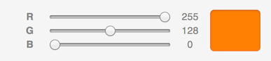

# Polymer Example Component

This project creates a simple example [Polymer](http://polymer-project.org) component, which creates an RGB slider like so:

----

Internally, the component uses Yahoo's [Pure CSS](http://purecss.io/grids/) grid library to demonstrate that the component's includes do not affect the outside DOM.